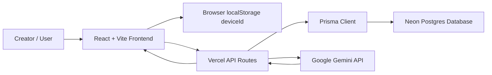

# ThumbnailChecker

ThumbnailChecker is a full-stack web app for YouTube creators who want to test thumbnails and titles before publishing. The app lets a creator upload a thumbnail, enter a video title, preview the video across YouTube-style layouts, get an AI-powered CTR prediction, and save previous thumbnail checks for later review.

## Project Purpose

Many YouTube creators make thumbnail and title decisions without seeing how their video will look in the real YouTube feed. ThumbnailChecker solves that problem by giving creators a quick way to preview, analyze, save, edit, and improve their thumbnail ideas before they publish.

## Target Users

- YouTube creators
- Streamers
- Gaming channels
- Educational channels
- Small businesses using YouTube for marketing
- Content teams reviewing thumbnails before upload

## Main Features

- Upload a YouTube thumbnail image
- Enter a video title
- Save thumbnail checks to a Neon Postgres database
- Preview the thumbnail and title in YouTube-style layouts
- View saved thumbnail checks in the UI
- Edit saved video titles
- Delete one saved thumbnail check
- Clear all saved thumbnail checks for the current device
- Toggle light and dark mode
- Use Gemini AI to analyze the thumbnail and title
- Show a CTR Prediction Score from 1 to 10
- Show AI feedback cards for readability, title strength, curiosity, mobile visibility, improvements, title ideas, and thumbnail text suggestions
- Show a thumbnail checklist before publishing
- Rate limit AI analysis to protect API usage

## Client Feedback Changes

During client testing, users said the app should not have two separate actions for saving/previewing and analyzing. Based on that feedback, the workflow was changed from two buttons into one automatic step.

Current flow:

1. User uploads a thumbnail.
2. User enters a video title.
3. User clicks `Save, Analyze & Preview`.
4. The app sends the thumbnail and title to Gemini AI.
5. The app receives a CTR Prediction Score and feedback.
6. The app saves the thumbnail check, AI feedback, and checklist to Neon.
7. The app opens the YouTube-style preview screen.

The AI score label was also changed to `CTR Prediction Score` so creators understand that the score is estimating how clickable the thumbnail/title combination may be.

## Preview Layouts

ThumbnailChecker previews thumbnails in multiple YouTube-style contexts:

- Desktop Home Feed
- Desktop Search Results
- Watch Next Sidebar
- Mobile Home
- Mobile Search
- YouTube TV

These previews help creators see whether their thumbnail and title are readable, clear, and clickable across different screen sizes.

## AI Thumbnail Coach

The AI Thumbnail Coach uses the Google Gemini API. It analyzes both the uploaded thumbnail image and the video title.

The AI returns structured feedback in these categories:

- CTR Prediction Score
- Thumbnail Readability
- Title Strength
- Curiosity / Click Appeal
- Mobile Visibility
- Suggested Improvements
- 3 Better Title Ideas
- Thumbnail Text Suggestions

The feedback is displayed as clean cards in the UI instead of plain text. When a thumbnail check is saved, the AI score and feedback can also be stored with that saved record.

## Thumbnail Checklist

The checklist gives creators a quick readiness check before publishing. It tracks whether:

- A thumbnail has been uploaded
- A title has been added
- The title length is scan-friendly
- The AI coach has reviewed the thumbnail
- The CTR Prediction Score is 7 or higher
- Mobile visibility has been reviewed

Saved thumbnail cards also show checklist progress.

## Database

The production database uses Neon Postgres with Prisma.

### Prisma Models

The app has two Prisma models:

```prisma
model Device {
  id          String                @id
  submissions ThumbnailSubmission[]
  createdAt   DateTime              @default(now())
  updatedAt   DateTime              @updatedAt
}

model ThumbnailSubmission {
  id        Int      @id @default(autoincrement())
  deviceId  String
  device    Device   @relation(fields: [deviceId], references: [id], onDelete: Cascade)
  title     String
  thumbnail String   @db.Text
  aiScore   Float?
  aiFeedback Json?
  checklist Json?
  createdAt DateTime @default(now())
  updatedAt DateTime @updatedAt
}
```

### Model Relationship

The relationship is one-to-many:

- One `Device` can have many `ThumbnailSubmission` records.
- Each `ThumbnailSubmission` belongs to one `Device`.
- The `deviceId` connects saved thumbnail checks to the browser/device that created them.

This lets each user see only their own saved thumbnail checks without requiring a login account.

## API Endpoints

### `/api/thumbnails`

Supports:

- `GET` - Load saved thumbnail checks for the current device
- `POST` - Create a new saved thumbnail check
- `PATCH` - Update a saved thumbnail check
- `DELETE` - Delete one saved thumbnail check or clear all checks for the current device

### `/api/analyze-thumbnail`

Supports:

- `POST` - Sends the thumbnail and title to Gemini AI and returns structured feedback

The AI endpoint is rate limited to reduce API abuse.

## System Architecture



## Tech Stack

- React
- Vite
- TypeScript
- Tailwind CSS
- Prisma
- Neon Postgres
- Google Gemini API
- Vercel
- Express for local API development

## Environment Variables

Create a local `.env` file and add these values:

```env
DATABASE_URL="your-neon-postgres-url"
GEMINI_API_KEY="your-gemini-api-key"
GEMINI_MODEL="gemini-2.5-flash"
```

The same environment variables must be added in Vercel Project Settings before deploying.

## Local Development

Install dependencies:

```bash
npm install
```

Push Prisma schema to the database:

```bash
npm run db:push
```

Run the local API server:

```bash
npm run dev:api
```

Run the Vite frontend:

```bash
npm run dev
```

Build for production:

```bash
npm run build
```

## Deployment

The app is designed to deploy on Vercel. Vercel serves the React frontend and runs the API routes. Neon stores saved thumbnail checks, and Gemini provides AI feedback.

Required Vercel environment variables:

```env
DATABASE_URL
GEMINI_API_KEY
GEMINI_MODEL
```

## Current Status

The project currently includes:

- Frontend upload and preview workflow
- Database-backed saved thumbnail checks
- Prisma models and relationship
- Gemini AI Thumbnail Coach
- CTR Prediction Score
- Thumbnail checklist
- Saved AI feedback
- Delete and clear-all saved checks
- Responsive layout with navigation, resource cards, preview panels, and footer

## Future Improvements

- Store thumbnail images in cloud storage instead of saving base64 image data in the database
- Add user accounts so saved checks can follow users across devices
- Add A/B thumbnail comparison
- Add shareable report links
- Add PDF export for AI feedback reports
- Add analytics for saved CTR prediction trends
